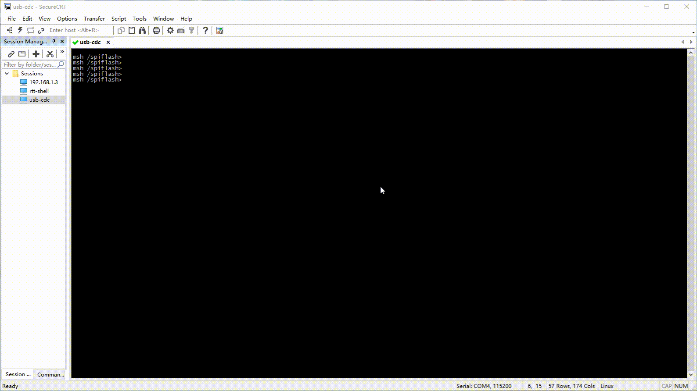

# Agile Console

## 1、介绍

Agile Console 是基于 RT-Thread 的一个简单易用的调试设备中间件。

- 接管 `console` 设备，支持 `device` 接口和 `posix` 接口。

- 后端实现极其方便，任何接口都可快速接入。

**注意** : 由于 Agile Console 会直接接管 `console` 设备，建议将 `RT-Thread`  `Kernel` 中的 `RT_CONSOLE_DEVICE_NAME` 配置为一个不存在的设备。

Agile Console 目前支持的后端接口如下：

- 串口后端

- USB CDC 后端

  使用到 [tinyusb](https://github.com/RT-Thread-packages/tinyusb)。

- Telnet 后端

  使用到 [agile_telnet](https://github.com/loogg/agile_telnet)。

### 1.1、目录结构

| 名称 | 说明 |
| ---- | ---- |
| doc | 文档 |
| examples | 示例 |
| figures | 素材 |
| inc  | 头文件 |
| src  | 源代码 |

### 1.2、许可证

Agile Console package 遵循 LGPLv2.1 许可，详见 `LICENSE` 文件。

### 1.3、依赖

- RT-Thread 4.0.3

- RT-Thread 4.0.5 ~ master

## 2、使用 Agile Console

- 帮助文档请查看 [doc/doxygen/Agile_Console.chm](./doc/doxygen/Agile_Console.chm)

- 使用 Agile Console package 需要在 RT-Thread 的包管理器中选择它，具体路径如下：

  ```c
  RT-Thread online packages
      peripheral libraries and drivers  --->
           [*] agile_console: Simple debugging device Middleware.  --->
              (1024) Set agile_console rx buffer size
              (tty) Set agile_console device name
              (9)  Set agile_console thread priority
              (2048) Set agile_console thread stack size
              [*]   Enable agile_console serial example
              (uart1) Set serial device name
              [*]   Enable telnet plugin
              [*]   Enable tinyusb plugin (RT-Thread 版本 >= 4.1.0)
                    Version (latest)  --->
  ```

  - **Set agile_console rx buffer size** ：Agile Console 接受环形缓冲区大小

  - **Set agile_console device name** ：Agile Console 设备名

  - **Set agile_console thread priority** ：Agile Console 线程优先级

  - **Set agile_console thread stack size** ：Agile Console 线程堆栈大小

  - **Enable agile_console serial example** ：使能串口例程

  - **Set serial device name** ：串口设备名

  - **Enable telnet plugin** ：使能 telnet 后端插件

    使能后会选中 [agile_telnet](https://github.com/loogg/agile_telnet) 软件包。

  - **Enable tinyusb plugin** ：使能 tinyusb 后端插件

    RT-Thread 版本 >= 4.1.0 才有该选项。使能后会选中 [tinyusb](https://github.com/RT-Thread-packages/tinyusb) 软件包。

- Doxygen 文档生成

  - 使用 `Doxywizard` 打开 [Doxyfile](./doc/doxygen/Doxyfile) 运行，生成的文件在 [doxygen/output](./doc/doxygen/output) 下。

  - 需要更改 `Graphviz` 路径。

  - `HTML` 生成未使用 `chm` 格式的，如果使能需要更改 `hhc.exe` 路径。

- 多后端演示

  演示使用开发板：正点原子探索者

  - 串口、Telnet 和 USB CDC 同时交互演示：

    

  - USB CDC Ymodem 传输文件

    CDC Fifo 接收大小修改为 1024

    CDC Fifo 发送大小修改为 2048

    

## 3、新的后端接入 Agile Console

- 可以参考 [examples](./examples) 文件夹中的例子和 [agile_telnet](https://github.com/loogg/agile_telnet) 软件包

- USB CDC 后端例子中展示了如何屏蔽输入输出

- Agile Console 提供了后端接口结构体定义：

  ```c
  /**
   * @brief   Agile Console 后端接口结构体
   */
  struct agile_console_backend {
      void (*output)(rt_device_t dev, const uint8_t *buf, int len); /**< 向后端输出数据接口 */
      int (*read)(rt_device_t dev, uint8_t *buf, int len);          /**< 从后端读取数据接口 */
      int (*control)(rt_device_t dev, int cmd, void *arg);          /**< 对后端进行设置接口 */
      rt_slist_t slist;                                             /**< 单向链表节点 */
  };
  ```

- 实现一个新的后端并接入 Agile Console 的步骤如下：

  1. 定义后端变量

  2. 实现后端的 `output`、`read` 和 `control` 接口

      - `output` 接口

        实现时 **不能调用任何可能导致线程挂起的 API** 。建议将数据放入 `ringbuffer` 并创建线程异步发送。

      - `read` 接口

        除了保护资源而使用的互斥锁外，其他引起阻塞的 API 不建议调用。已有的数据存放到数据区后立马返回。

      - `control` 接口

        该接口用作控制后端。除 `TCFLSH` 命令，其他命令均会调用该接口。可不实现。

  3. 调用 `agile_console_backend_register` 注册后端

  4. 后端收到数据时调用 `agile_console_wakeup` 唤醒接收线程

## 4、联系方式 & 感谢

- 维护：马龙伟
- 主页：<https://github.com/loogg/agile_console>
- 邮箱：<2544047213@qq.com>
